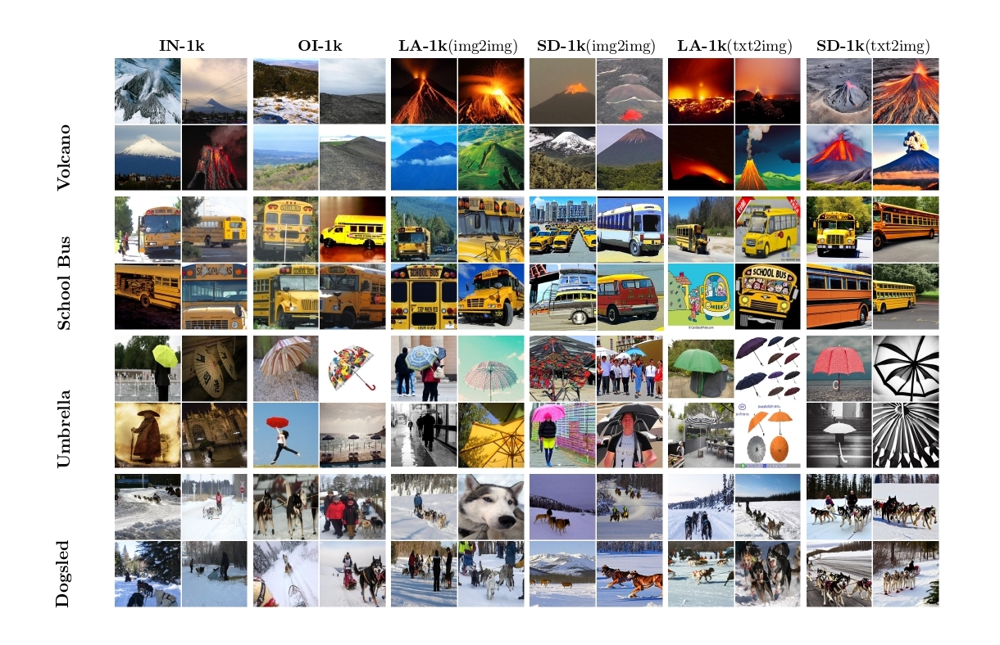

# 🌋 SELECT: A Large-Scale Benchmark of Data Curation Strategies for Image Recognition
This is the repository for the SELECT benchmark and ImageNet++ dataset. All of our code is open-source.

---

We introduce SELECT, a formal strategy to benchmark labeled datasets and orient data engineers to direct their. Utilizing SELCET, we evaluate ImageNet++ as the largest and most diverse superset of the ImageNet-1k training set to date. ImageNet++ extends beyond the scope of traditional datasets by incorporating 5 distinct training shifts and utilizing distinct selection techniques. The constituent datasets of ImageNet++ are enumerated as follows:
1. OpenImages-1000 (OI1000): A subset of the OpenImages dataset constructed via schema mapping.
2. LAION-1000 (LA1000): A subset of the unlabeled LAION dataset, selected through CLIP retrieval nearest neighbors search against the ImageNet-1k training set.
3. Stable Diffusion-1000 (SD1000): A dataset generated from the ImageNet-1k dataset using an image-to-image Stable Diffusion pipeline



## Table of Contents

1. [Dataset](#dataset)
2. [Installation](#installation)
3. [Create ImageNet++](#imagenetpp)
4. [Train models on ImageNet++](#Train)
5. [Evaluation Benchmark](#eval)
6. [Paper, website, and docs](#paper)
7. [Citation](#citation)

## Dataset 
The complete dataset is accessible via Huggingface.

Download from [Huggingface](https://huggingface.co): `git lfs clone https://huggingface.co`.

```
├── ImageNet++
    ├── OpenImages-1000(OI-1000)
    ├── LAION-1000(LA-1000)
        ├── LA-1000(img2img)
        ├── LA-1000(txt2img)
        └── LA-1000(substring matching)
    └── StableDiffusion-1000
        ├── SD-1000(txt2img)
        └── SD-1000(img2img)
``` 
We show some image examples from ImageNet++ as above. 

## Installation
Firstly, download and set up the repo:
```
git clone https://github.com/jimmyxu123/SELECT-1.2M.git
cd 
```
## Create ImageNet++  
### OI-1000

### LA-1000
#### img2img
#### txt2img
Inspired by [LAIONNet](https://github.com/alishiraliGit/eval-on-laion), we augmented the original LAIONNet dataset to 1.2M firstly filtering examples where the corresponding caption contains one and only one of the synsets of ImageNet from LAION-400M. Then we only retain examples where the similarity between the ImageNet synset definition and the caption exceeds a threshold of 0.5 with CLIP.
#### substring matching

### SD-1000
#### img2img
#### txt2img

## Train on ImageNet++
We use [timm](https://github.com/huggingface/pytorch-image-models) scripts to train models on our dataset ImageNet++. For instance, to launch training on OI1000 with N GPUs on one node:
```
torchrun --nnodes=1 --nproc_per_node=N train.py -c config/oi1000-rn50-tv-wds.yaml
```
You can modify the configuration file to decide your favorite hyperparameters.

## Evaluation Benchmark

#### VTAB

#### Self-supervised learning
You can run a self-supervised learning method DINO KNN evaluation on ImageNet++. For people running in a SLURM environment, run `unset SLURM_PROCID` first to avoid triggering an error with the distributed code. 
For running on a webdataset format dataset, please follow the below code. 
```
#Example eval command on WDS SD1000(img2img)
python ssl/eval_knn.py --train_data_path "/your/dataset/path/to/sd-imagenet-wds/{00000..01197}.tar" --train_data_type wds --val_data_path /imagenet/val --pretrained_weights resnet50 --arch resnet50 --dump_train_features /your/path/to/dino/logs/sdimg2img-5spc-train-wds --load_val_features /scratch/bf996/dino/logs/imagenet-val --batch_size_per_gpu 1000 --dataset_n_samples 5000
```
For running on a huggingface dataset, please follow the below code.
```
#HFDS SD1000(txt2img)
python ssl/eval_knn.py --train_data_path "/your/dataset/path/to/ek826___imagenet-gen-sd1.5" --train_data_type hfds --val_data_path /imagenet/val --pretrained_weights resnet50 --arch resnet50 --dump_train_features /scratch/bf996/dino/logs/sdtxt2img-5spc-train-wds --load_val_features /scratch/bf996/dino/logs/imagenet-val --batch_size_per_gpu 1000 --dataset_n_samples 5000 > /scratch/bf996/dino/logs/sdtxt2img-5spc-val.txt;
```
For imbalanced datasets, you can use oversampling to increase the number of real labeled samples per class by adding another argument `--dataset_n_search`. Here is an example:
```
#Example eval command on WDS OI1000
python ssl/eval_knn.py --train_data_path "/your/dataset/path/to//oi1k-imagenet/{00000..01227}.tar" --train_data_type wds --val_data_path /imagenet/val --pretrained_weights resnet50 --arch resnet50 --dump_train_features /scratch/bf996/dino/logs/openimages-10spc-train-wds-oversample --load_val_features /scratch/bf996/dino/logs/imagenet-val --batch_size_per_gpu 1000 --dataset_n_samples 10000 --dataset_n_search 100000;
```


## Paper, Website, and Docs
<h2 id="paper"></h2>

## Acknowledgement


## Citation

If you find our work useful, please consider citing as follows.

