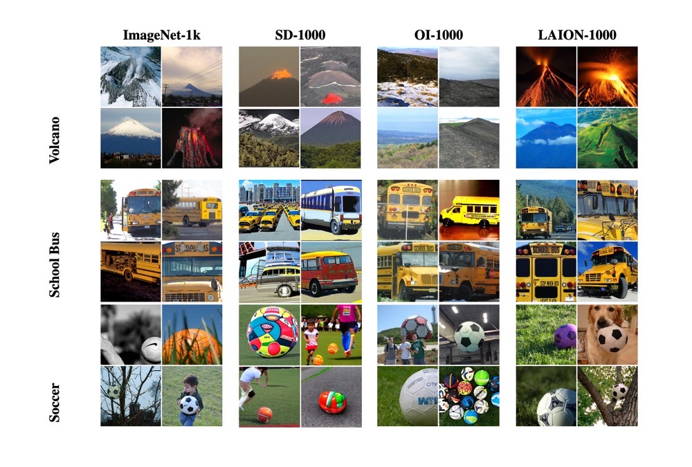

# 🌋 ImageNetPP: A Large-Scale Benchmark of Data Curation Strategies
This is the repository for the ImageNet++ benchmark 

---

We introduce a novel benchmark, ImageNet++, which is the largest and most diverse superset of the ImageNet-1k training set to date. ImageNet++ extends beyond the scope of traditional datasets by incorporating 7 distinct training shifts, each employing a unique modality of data (two natural and one synthetic) and utilizing distinct selection techniques. The constituent datasets of ImageNet++ are enumerated as follows:
1. OpenImages-1000 (OI1000): A subset of the OpenImages dataset constructed via schema mapping.
2. LAION-1000 (LA1000): A subset of the unlabeled LAION dataset, selected through CLIP retrieval nearest neighbors search against the ImageNet-1k training set.
3. Stable Diffusion-1000 (SD1000): A dataset generated from the ImageNet-1k dataset using an image-to-image Stable Diffusion pipeline



## Table of Contents

1. [Dataset](#dataset)
2. [Create ImageNet++](#imagnetpp)
3. [Paper, website, and docs](#paper)
4. [Citation](#citation)

## Dataset 
The complete dataset is accessible via Huggingface.

Download from [Huggingface](https://huggingface.co): `git lfs clone https://huggingface.co`.

```
├── ImageNet++
    ├── 
    ├── 
    ├── 
    └── 
        ├── 
        ├── 
        └──  
``` 
We show some image examples from ImageNet++ as above. 

## Installation
```

```
##

##

## 

## Acknowledgement


## BibTeX

If you find our work useful, please consider citing as follows.

